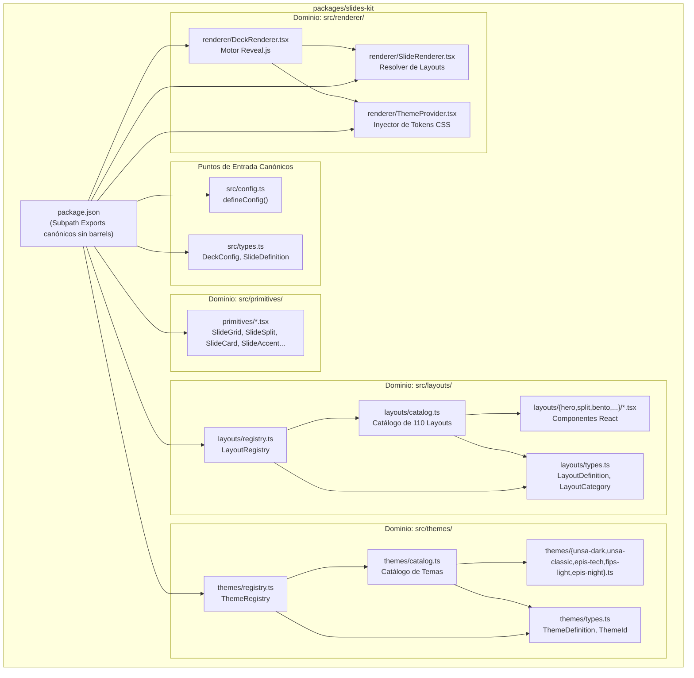
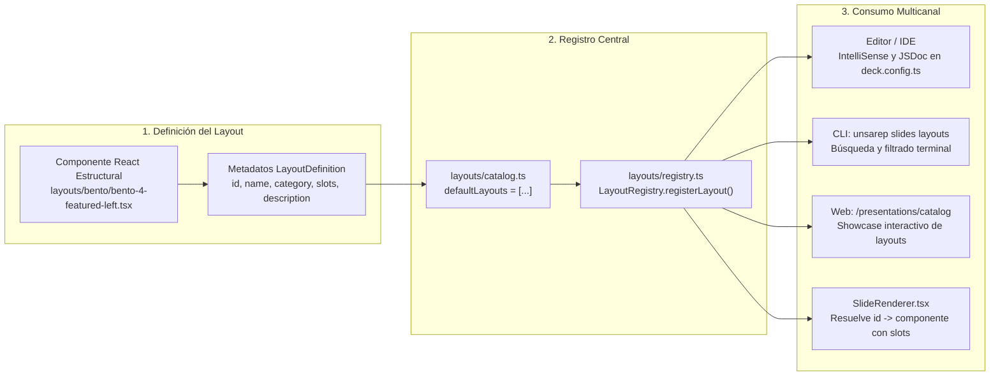
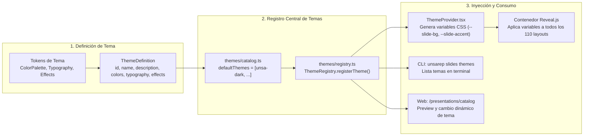
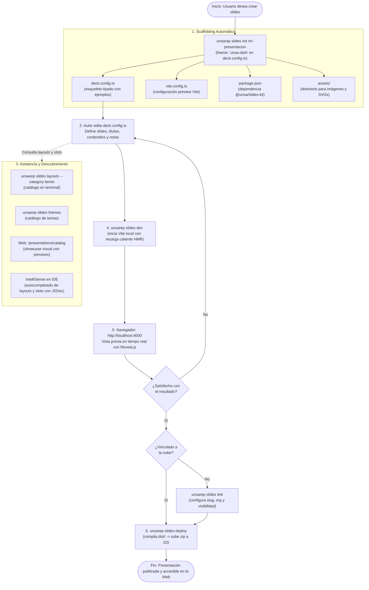
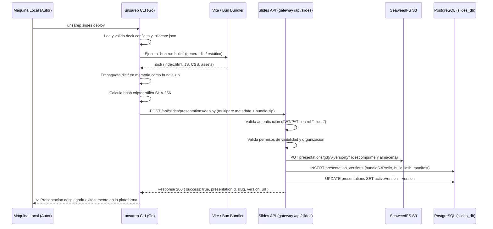

# Arquitectura del Módulo de Diapositivas (Slides) — UNSAReport

Este documento describe la arquitectura técnica, flujos de diseño, estructura de archivos y secuencia de despliegue del ecosistema de diapositivas académicas e interactivas de **UNSAReport**.

---

## 1. Visión General del Ecosistema

El ecosistema de diapositivas está desacoplado en cuatro componentes fundamentales:
- **`packages/slides-kit` (`@unsa/slides-kit`)**: Kit modular con 110 layouts, temas oficiales, primitivas y motor Reveal.js.
- **`tui/` (`unsarep slides`)**: CLI en Go para inicialización, descubrimiento, desarrollo local con HMR y empaquetado hacia la nube.
- **`slides/`**: Microservicio backend (Hono + PostgreSQL + SeaweedFS S3) para almacenamiento, versionado y entrega estática.
- **`web/` (`web/app`)**: Plataforma web institucional con dashboard por organizaciones, visor con shell institucional e iframe sandboxed, y catálogo interactivo.

```mermaid
flowchart TD
    subgraph Kit["packages/slides-kit<br/>(@unsa/slides-kit)"]
        DefineConfig["defineConfig()"]
        Registry["LayoutRegistry<br/>(110 layouts registrados)"]
        ThemeReg["ThemeRegistry<br/>(5 temas: unsa-dark, unsa-classic, epis-tech, fips-light, epis-night)"]
        Primitives["Primitivas CSS<br/>(Grid, Split, Bento, Stack)"]
        Renderer["DeckRenderer<br/>(Reveal.js + React)"]

        DefineConfig --> Registry
        DefineConfig --> ThemeReg
        Registry --> Primitives
        ThemeReg --> Renderer
    end

    subgraph User["Proyecto del Autor (Local)"]
        Config["deck.config.ts<br/>(TypeScript tipado + IntelliSense)"]
        Custom["src/components/<br/>(Componentes React custom)"]
        Assets["assets/<br/>(imágenes, SVGs)"]
    end

    subgraph CLI["unsarep CLI (Go)"]
        Init["unsarep slides init (theme key in deck.config.ts)"]
        Layouts["unsarep slides layouts<br/>(catálogo en terminal)"]
        ThemesCmd["unsarep slides themes<br/>(explorador de temas)"]
        Import["unsarep slides import deck.pptx<br/>(colores/fuentes a themes/slug.ts)"]
        Dev["unsarep slides dev<br/>(preview local Vite)"]
        Deploy["unsarep slides deploy<br/>(build → zip → S3)"]

    subgraph Backend["Slides Service (interno :3002; público vía gateway /api/slides)"]
        API["Hono API"]
        S3Lib["S3 Client<br/>(SeaweedFS)"]
        PG[("PostgreSQL<br/>slides_db")]
    end

    subgraph Web["Web App (:3100)"]
        Catalog["/presentations/catalog<br/>(Galería de Layouts y Temas)"]
        Dashboard["/presentations<br/>(Dashboard por grupo)"]
        Viewer["/presentations/$slug<br/>(Visor con Shell)"]
    end

    Config -->|importa| Kit
    Custom -->|importa| Kit
    User -->|"empaquetado por"| CLI
    Init --> User
    Dev --> User
    CLI -->|"POST /deploy multipart"| API
    API -->|"almacena assets"| S3Lib
    API -->|"persiste metadatos"| PG
    Web -->|"GET /api/slides/embed/:id/v:version/*"| API
    Web -->|"consulta metadatos"| API
```

---

## 2. Estructura Canónica de Archivos de `@unsa/slides-kit`

Siguiendo las directrices del proyecto:
1. **Sin barrel files**: Se prohíbe el uso de `index.ts` que re-exporten indiscriminadamente componentes o módulos.
2. **Subpath exports**: Cada submódulo se expone canónicamente mediante el bloque `exports` en `package.json`.
3. **Neutralidad cromática de layouts**: Los 110 layouts son estrictamente estructurales (geometría, tipometría y layout CSS), dejando la paleta cromática a los temas.
4. **Importaciones absolutas**: En todo el monorepo se emplea exclusivamente el alias `@/*`.



---

## 3. Flujo de Registro y Resolución de Layouts

El sistema soporta 110 layouts agrupados en 9 familias funcionales (`hero`, `split`, `bento`, `stats`, `process`, `code`, `list`, `quote`, `closing`).



---

## 4. Flujo de Registro e Inyección de Temas

Los temas inyectan dinámicamente variables CSS en el contenedor de Reveal.js (`--slide-bg`, `--slide-text`, `--slide-accent`, `--slide-border`, etc.), permitiendo que cualquier layout adopte automáticamente la identidad visual de la institución o carrera.



---

## 5. Ciclo de Vida del Autor y Creación de Slides

Describe el flujo de trabajo de un autor o estudiante desde la inicialización en la terminal hasta la publicación en la web institucional:



---

## 6. Secuencia de Empaquetado, Despliegue hacia S3 y Entrega

Describe la interacción entre el CLI, el compilador Vite/Bun, la API Hono, la base de datos PostgreSQL y el almacenamiento de objetos SeaweedFS:



---

## 7. Runbook E2E: de login a PDF

Flujo completo autor → nube → visor → PDF (local dev contra el gateway
`http://localhost:9876`; en prod usa `https://unsareport.ynoacamino.tech`).

```bash
# 1. Login (requiere cuenta IdP; el deploy exige además el rol "slides")
unsarep slides login
unsarep slides whoami   # verifica usuario + alcance del servicio

# 2. Scaffold + edición
unsarep slides init mi-charla
cd mi-charla            # edita deck.config.ts (theme: 'unsa-dark', slides, notas)

# 3. Preview local (default --port 4000)
unsarep slides dev      # abre http://localhost:4000

# 4. Link (slug/org/visibilidad → .slidesrc.json; deck.config.ts gana)
unsarep slides link --title "Mi charla" --slug mi-charla --visibility public
# org: unsarep slides link --title "Mi charla" --org mi-facultad --visibility org

# 5. Deploy (bundle ≤ 50 MiB; crea versión vN)
unsarep slides deploy --yes

# 6. Presentar en la web
# Viewer: /presentations/mi-charla          (shell + iframe sandboxed)
# Present: /presentations/mi-charla?present=1  (viewport completo)

# 7. Notas de orador: viajan en manifest.notes (Record<slideId, texto>);
# GET /api/slides/presentations/:id las expone como version.notes.

# 8. PDF: botón "PDF" del visor (abre el embed con ?print-pdf).
```

### Semántica auth / org / visibilidad / versiones

- **Auth**: PAT/JWT vía `unsarep slides login` (o `--token` / `UNSAREP_TOKEN`).
  El deploy falla sin credencial; el 401/403 indica credencial ausente o
  rol `slides` no otorgado (pide a un admin el rol vía el flujo IdP).
- **Org**: `--org <slug>` publica bajo una organización; vacío = personal.
- **Visibilidad**: `private` (solo dueño) · `org` (miembros) ·
  `unlisted` (con enlace) · `public` (listada). Default `private`.
- **Versiones**: cada deploy crea `vN` (`activeVersion = N`); el visor
  permite elegir versión; el embed sirve `/api/slides/embed/:id/vN/...`.

### Switch de entorno (env vars)

| Variable | Local dev | Prod (default) |
|----------|-----------|----------------|
| `UNSAREP_SLIDES_URL` | `http://localhost:9876/api/slides` | `https://unsareport.ynoacamino.tech/api/slides` |
| `SLIDES_URL` (web server) | `http://localhost:9876/api/slides` | según despliegue |
| `UNSAREP_TOKEN` | PAT local | PAT prod |
| `UNSAREP_IDP_ISSUER` | `http://localhost:9876/api/auth` | según despliegue |

La web habla con slides vía `SLIDES_URL` (server) y el gateway
`/api/slides/*` → servicio interno `:3002`; el CLI usa `UNSAREP_SLIDES_URL`.

