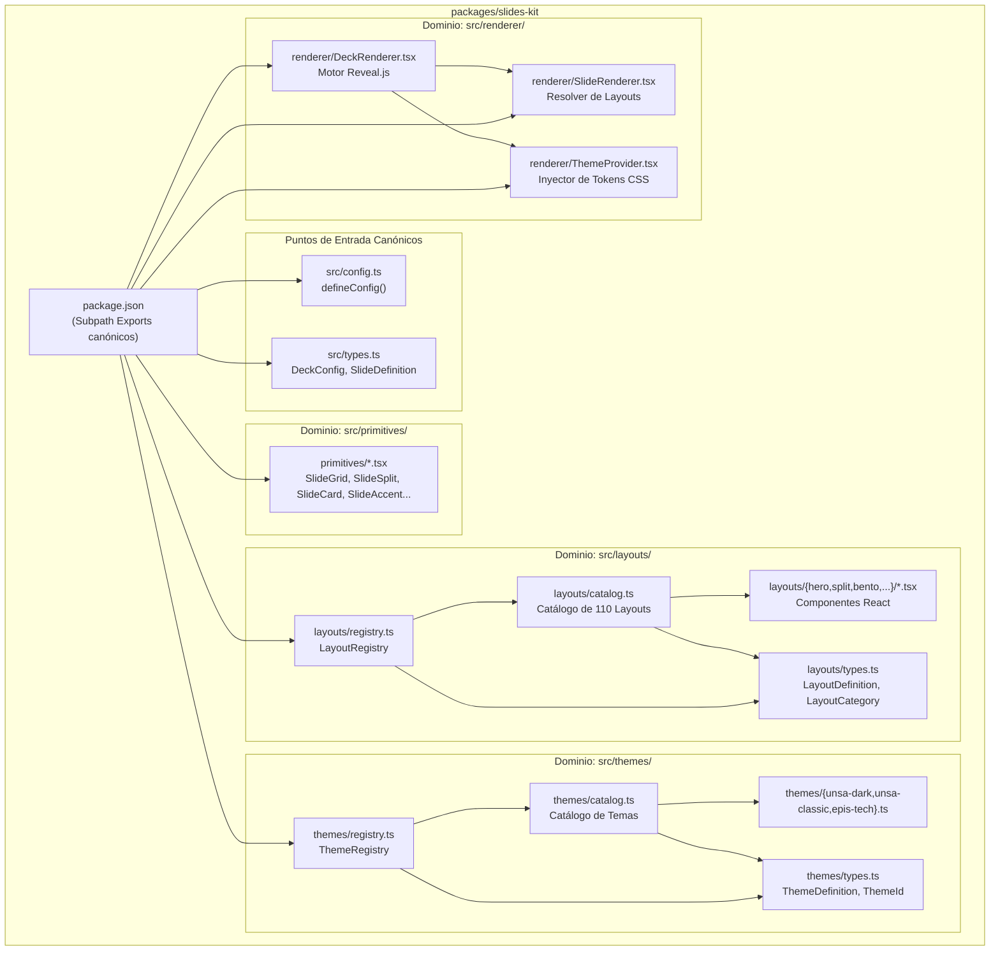
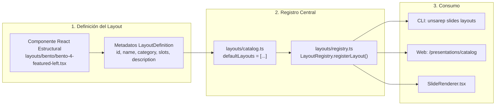
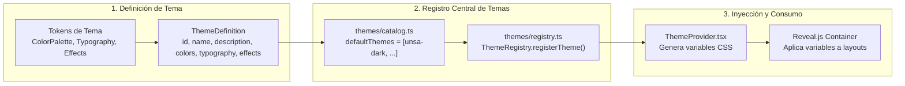

# @unsa/slides-kit

Kit oficial de diapositivas interactivas para el ecosistema **UNSAReport**, basado en Reveal.js, React y TypeScript.

---

## Características

- 🎯 **110 Layouts Oficiales** organizados en 9 familias (`hero`, `split`, `bento`, `stats`, `process`, `code`, `list`, `quote`, `closing`).
- 🎨 **Layouts Neutros**: Los componentes son estrictamente estructurales; el color, tipografía y estilo visual son inyectados exclusivamente por los temas a través de variables CSS.
- 🏛️ **Temas Institucionales**: `unsa-dark` (predeterminado institucional), `unsa-classic` (académico formal), `epis-tech` (ciencias de la computación / tecnología).
- 🧩 **Primitivas Flexibles**: `SlideGrid`, `SlideSplit`, `SlideStack`, `SlideCard`, `SlideAccent`, `SlideSection`.
- 📦 **Cero Barrel Files**: Exportaciones canónicas directas mediante `package.json` para optimizar compilación y tree-shaking.
- ⚡ **Tipado Estricto**: Función `defineConfig()` para configuración de presentaciones con autocompletado en el IDE.

---

## Estructura de Módulos



---

## Flujo de Registro de Layouts



---

## Flujo de Registro e Inyección de Temas



---

## Uso en `deck.config.ts`

```typescript
import { defineConfig } from '@unsa/slides-kit';

export default defineConfig({
  title: 'Investigación en Inteligencia Artificial',
  theme: 'unsa-dark',
  slides: [
    {
      id: 'portada',
      layout: 'hero-split',
      title: 'Avances en Modelos Generativos',
      subtitle: 'Facultad de Ingeniería de Producción y Servicios',
      author: 'Gustavo Dev',
      date: '2026-09-26',
    },
    {
      id: 'arquitectura',
      layout: 'bento-4-featured-left',
      badge: 'Metodología',
      title: 'Módulos del Sistema',
      featured: {
        title: 'Core Engine',
        description: 'Procesamiento de datos en tiempo real.',
      },
      cards: [
        { title: 'Ingesta', description: 'Pipeline de datos' },
        { title: 'Inferencia', description: 'Modelos pre-entrenados' },
        { title: 'Auditoría', description: 'Trazabilidad y métricas' },
      ],
    },
  ],
});
```

---

## Subpath Exports

Para importar componentes y utilidades del paquete:

```typescript
// Configuración y tipos base
import { defineConfig } from '@unsa/slides-kit';
import type { DeckConfig, SlideDefinition } from '@unsa/slides-kit/types';

// Registros de layouts y temas
import { layoutRegistry, listLayouts } from '@unsa/slides-kit/layouts';
import { themeRegistry, getTheme } from '@unsa/slides-kit/themes';

// Renderizadores
import { DeckRenderer } from '@unsa/slides-kit/renderer/DeckRenderer';
import { ThemeProvider } from '@unsa/slides-kit/renderer/ThemeProvider';

// Primitivas CSS
import { SlideCard } from '@unsa/slides-kit/primitives/SlideCard';
```
